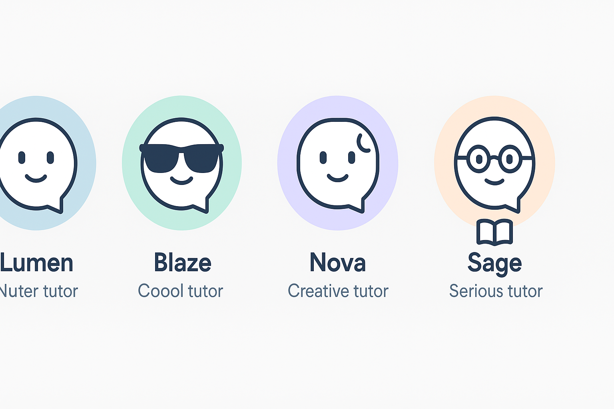

# 🎨 Diseño - OmegaLab 2025

¡Mucho éxito creando y diseñando lo que marcará la diferencia! 🚀

## Paleta de colores

> **Justificación:**  
> Utilizamos una paleta de colores **cálidos y amigables** para generar **confianza, cercanía y bienestar emocional** en los estudiantes.  
> Los tonos pastel, suaves y balanceados ayudan a transmitir calma, reducir la percepción de estrés y hacer que la experiencia visual sea menos invasiva y más acogedora.

## Iconos

Se usó [Lucide](https://lucide.dev/) para los íconos.

> **Justificación:**  
> Lucide proporciona **íconos minimalistas, consistentes y ligeros**, lo cual se alinea con nuestro enfoque de simplicidad, velocidad y facilidad de interpretación visual.  
> Además, su versatilidad nos permite integrarlos sin romper la armonía del diseño general.

## Logos

> **Justificación:**  
> El logo mantiene un diseño simple, dinámico y versátil que refuerza los valores de **innovación y frescura** que buscamos transmitir con todo el sistema visual.

## Diseño de tutores

> **Justificación:**  
> Creamos 4 tutores virtuales, cada uno con **personalidades diferenciadas** pero manteniendo un **estilo visual uniforme**:  
> - Minimalismo en las líneas para no sobrecargar.  
> - Fondos circulares en tonos pastel para reflejar **calidez y accesibilidad**.  
> - Elementos simbólicos simples (estrella, gafas, luna, libro) que representan de forma inmediata la personalidad de cada tutor.
>  
> Esta propuesta busca que los estudiantes se identifiquen de manera emocional con el acompañamiento que mejor se adapte a su estilo personal.
